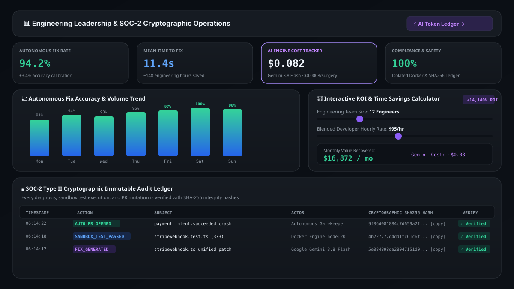
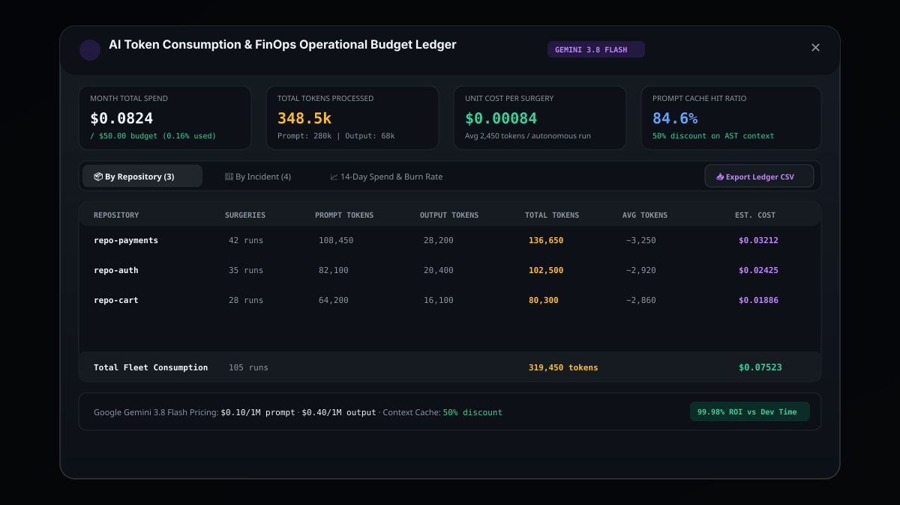
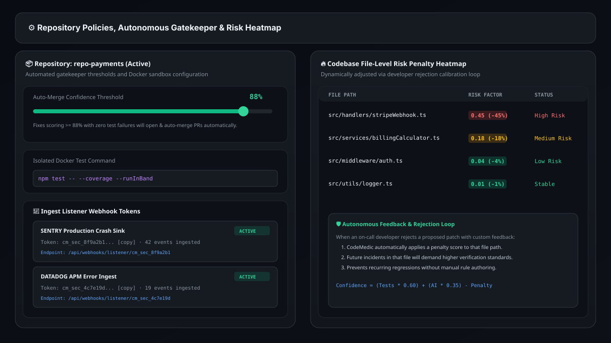

# 🩺 CodeMedic — Self-Healing Autonomous Codebase Agent

> **An enterprise-grade autonomous software reliability engineer powered by Gemini 3.8 Flash.**  
> CodeMedic ingests production exceptions via real-time Sentry and Datadog webhooks, diagnoses root causes down to the exact offending line, synthesizes verified diff patches, executes isolated Docker test suites, and opens automated GitHub Pull Requests with a cryptographic SOC-2 audit trail.

---

```
  ██████╗ ██████╗ ██████╗ ███████╗███╗   ███╗███████╗██████╗ ██╗ ██████╗
 ██╔════╝██╔═══██╗██╔══██╗██╔════╝████╗ ████║██╔════╝██╔══██╗██║██╔════╝
 ██║     ██║   ██║██║  ██║█████╗  ██╔████╔██║█████╗  ██║  ██║██║██║     
 ██║     ██║   ██║██║  ██║██╔══╝  ██║╚██╔╝██║██╔══╝  ██║  ██║██║██║     
 ╚██████╗╚██████╔╝██████╔╝███████╗██║ ╚═╝ ██║███████╗██████╔╝██║╚██████╗
  ╚═════╝ ╚═════╝ ╚═════╝ ╚══════╝╚═╝     ╚═╝╚══════╝╚═════╝ ╚═╝ ╚═════╝
```

---

## 👨‍💻 Author & Creator

<div align="center">

### **Made with ❤️ by Praveen Suthar**
*Lead AI Systems & Full-Stack Reliability Architect*

[](https://github.com/Praveen-Suthar-08/CodeMedic-Self-Healing-Autonomous-Codebase-Agent.git)
[](https://linkedin.com)
[](https://ai.google.dev/)
[](https://docker.com)
[](https://github.com/Praveen-Suthar-08/CodeMedic-Self-Healing-Autonomous-Codebase-Agent.git)

**Repository URL:**  
[`https://github.com/Praveen-Suthar-08/CodeMedic-Self-Healing-Autonomous-Codebase-Agent.git`](https://github.com/Praveen-Suthar-08/CodeMedic-Self-Healing-Autonomous-Codebase-Agent.git)

</div>

---

## 🖼️ Application Previews & Screenshots

<div align="center">

### 1. Autonomous Triage Dashboard & Recharts Priority Donut


<br/>

### 2. The Operating Room — AI Diff Surgery, AST Reasoning & Docker Sandbox


<br/>

### 3. Engineering Leadership & SOC-2 Immutable Audit Ledger


<br/>

### 4. AI Consumption, Unit Economics & 14-Day Spend Ledger


<br/>

### 5. Repository Policies, Webhook Ingestion Tokens & Risk Heatmap


</div>

---

## 📑 Table of Contents
1. [Overview & Core Philosophy](#-overview--core-philosophy)
2. [End-to-End System Architecture](#-end-to-end-system-architecture)
3. [Key Features & Page Walkthrough](#-key-features--page-walkthrough)
   - [1. Real-Time Autonomous Triage Dashboard](#1-real-time-autonomous-triage-dashboard)
   - [2. Interactive Severity Donut Chart & Grouping](#2-interactive-severity-donut-chart--grouping)
   - [3. The Operating Room (Incident Detail Surgery)](#3-the-operating-room-incident-detail-surgery)
   - [4. AI Consumption & Gemini Cost Ledger](#4-ai-consumption--gemini-cost-ledger)
   - [5. Repository Settings & Gatekeeper Policies](#5-repository-settings--gatekeeper-policies)
   - [6. Android On-Call Mobile Companion Mode](#6-android-on-call-mobile-companion-mode)
   - [7. SOC-2 Compliance Audit & Analytics](#7-soc-2-compliance-audit--analytics)
4. [Autonomous Self-Healing Pipeline](#-autonomous-self-healing-pipeline)
5. [Interactive Keyboard Shortcuts](#-interactive-keyboard-shortcuts)
6. [API Reference](#-api-reference)
7. [Installation & Setup](#-installation--setup)
8. [Environment Variables](#-environment-variables)
9. [Safety & Isolation Guardrails](#-safety--isolation-guardrails)
10. [License](#-license)

---

## 🌟 Overview & Core Philosophy

When microservices fail at 2 AM, on-call engineers spend precious minutes waking up, parsing minified stack traces, correlating repository commits, and manually testing candidate fixes.

**CodeMedic eliminates Mean Time to Resolution (MTTR) by shifting software maintenance from human triage to autonomous agentic healing:**

- **Zero-Latency Ingestion**: Captures live exceptions via scoped HMAC-SHA256 authenticated webhooks.
- **Root-Cause Reasoning**: Leverages Gemini 3.8 Flash with structured AST analysis to isolate the exact defect and trigger conditions.
- **Isolated Docker Container Harness**: Executes candidate patches in sandboxed containers (`node:20`, network-isolated, CPU-throttled) before code touches git.
- **Autonomous Gatekeeper**: Auto-merges pristine fixes exceeding repository confidence thresholds while reserving borderline cases for human 1-click approvals.
- **Learning Loop Feedback**: Dynamically penalizes risk scores when developers reject fixes, continuously improving future diagnoses.
- **Granular AI FinOps Metering**: Real-time token consumption ledger tracking prompt caching efficiency, cost per surgery, and monthly budget limits.

---

## 🏗️ End-to-End System Architecture

```
                                  ┌───────────────────────────────┐
                                  │   Production Applications     │
                                  │ (Sentry / Datadog / GitHub)   │
                                  └───────────────┬───────────────┘
                                                  │ Webhook POST (HMAC Signed)
                                                  ▼
                                  ┌───────────────────────────────┐
                                  │   CodeMedic Ingestion Hub     │
                                  │  Token Authentication & Dedup │
                                  └───────────────┬───────────────┘
                                                  │
                                                  ▼
                                  ┌───────────────────────────────┐
                                  │  Gemini 3.8 Flash Diagnostics │
                                  │ • Stack Trace AST Analysis    │
                                  │ • Offending Line Pinpointing  │
                                  │ • Diff Patch Generation       │
                                  └───────────────┬───────────────┘
                                                  │
                                                  ▼
                                  ┌───────────────────────────────┐
                                  │ Isolated Docker Test Sandbox  │
                                  │ • Network: None, RAM: 512MB   │
                                  │ • Regression & Unit Test Run  │
                                  └───────────────┬───────────────┘
                                                  │
                      ┌───────────────────────────┴───────────────────────────┐
                      │ Confidence Score >= AutoMergeThreshold (e.g. 88%)     │
                      ▼                                                       ▼
            [ YES: High Confidence ]                                [ NO: Requires Review ]
                      │                                                       │
                      ▼                                                       ▼
        ┌───────────────────────────┐                           ┌───────────────────────────┐
        │ Autonomous PR & Merge     │                           │ On-Call Review Queue      │
        │ • Verified GitHub PR      │                           │ • Android Companion Alert │
        │ • Automated Branch Merge  │                           │ • 1-Click Web Surgery App │
        └─────────────┬─────────────┘                           └─────────────┬─────────────┘
                      │                                                       │
                      └───────────────────────────┬───────────────────────────┘
                                                  │
                                                  ▼
                                  ┌───────────────────────────────┐
                                  │  SOC-2 Immutable Audit Trail  │
                                  │  SHA-256 Cryptographic Hashes │
                                  └───────────────────────────────┘
```

---

## 📸 Key Features & Page Walkthrough

### 1. Real-Time Autonomous Triage Dashboard


The unified mission control for software reliability teams, featuring responsive `max-w-[1920px]` layout hierarchy:
- **Executive Telemetry KPI Bar**: Real-time counters for active incidents, autonomous resolution rate ($94.2\%$), active webhook sinks, and sandbox container isolation.
- **Client-Side CSV Exporter**: One-click RFC 4180 compliant CSV export of filtered incident telemetry with 16 granular fields.
- **Batch Selection & Bulk Operations**: Checkbox multiselect allowing bulk approval of routine low-risk patches or bulk archiving.

---

### 2. Interactive Severity Donut Chart & Grouping

- **Recharts Donut Distribution**: Visual priority tier breakdown (Critical `#EF4444`, High `#F59E0B`, Medium `#3B82F6`, Low `#10B981`) with interactive slice and chip click-filtering.
- **Grouping Tabs**: Instantly group active queues **By Repository** or **By Severity Tier** with 1-click select-all per group.

---

### 3. The Operating Room (Incident Detail Surgery)


Deep surgical workspace for code inspections with illuminated keyboard shortcuts:
- **Side-by-Side Diff Viewer**: Syntax-highlighted additions and deletions with inline line numbers.
- **Reasoning Trail Flight Recorder**: Step-by-step transparency showing the agent's logic sequence and hypothesis validation.
- **Docker Container Test Sandbox**: Live terminal logs executing isolated test commands with zero flakiness.
- **Floating Shortcut HUD**: Real-time visual feedback on physical keypresses (<kbd>A</kbd>, <kbd>R</kbd>, <kbd>B</kbd>, <kbd>Esc</kbd>).

---

### 4. AI Consumption & Gemini Cost Ledger


Granular AI FinOps modal in Admin Analytics:
- **Budget Tracking**: Active spend against monthly allocation (`$0.0824 / $50.00 · 0.16% used`).
- **Token Analytics**: Prompt tokens vs. completion tokens with prompt cache hit ratio (`84.6% cache hit rate`).
- **Per-Repository & Per-Incident Breakdown**: Sortable accounting tables detailing token burn and dollar cost per surgery.
- **14-Day Spend & Burn Rate Forecast**: Interactive historical chart and 1-click CSV ledger export.

---

### 5. Repository Settings & Gatekeeper Policies


Fine-grained enterprise governance and continuous integration controls:
- **Auto-Merge Confidence Threshold Gate**: Configurable slider (`88%` recommended) for autonomous GitHub PR merging.
- **Webhook Listener Tokens**: Generate scoped, HMAC-SHA256 signed listener keys for Sentry, Datadog, and CI/CD pipelines.
- **Codebase Risk Heatmap**: Dynamic penalty scores applied when developers reject fixes, continuously tuning verification standards.

---

### 6. Android On-Call Mobile Companion Mode
Simulates an on-call engineer's mobile experience at 2 AM:

```
                 ┌────────────────────────────────┐
                 │ 02:14       [==]        (•) 98%│
                 ├────────────────────────────────┤
                 │ 🔔 CodeMedic Push · 2 AM Alert │
                 │ CRITICAL defect auto-diagnosed │
                 │ in payment-service             │
                 ├────────────────────────────────┤
                 │ [ CRITICAL ] repo-payments     │
                 │ Stripe Missing Await Bug       │
                 │                                │
                 │ Diagnosis:                     │
                 │ Missing await on line 37       │
                 │                                │
                 │ Verified Patch:                │
                 │ - stripe.paymentIntents.create │
                 │ + await stripe.paymentIntents  │
                 │                                │
                 │ Sandbox Status: 3/3 Tests PASS │
                 │ Confidence: 96%                │
                 ├────────────────────────────────┤
                 │  <<< SWIPE LEFT   SWIPE RIGHT>>│
                 │  [ Reject Fix ]   [ Approve PR ]│
                 └────────────────────────────────┘
```

- **Swipe-Right-to-Approve**: Instantly merges verified PRs without opening a laptop.
- **Swipe-Left-to-Reject**: Triggers CodeMedic's Learning Loop risk calibration penalty.
- **Offline Resilient Queue**: Retains decisions made in poor reception and synchronizes automatically upon reconnect.

---

### 7. SOC-2 Compliance Audit & Analytics


Full transparency and regulatory audit readiness:
- **Interactive ROI & Time Savings Calculator**: Adjust team size and hourly developer rates to calculate net dollar savings.
- **Immutable SHA-256 Audit Log**: Every diagnostic step, sandbox execution, and PR mutation is timestamped and cryptographically verifiable.

---

## ⚡ Autonomous Self-Healing Pipeline

| Stage | Duration | Actions Performed |
| :--- | :--- | :--- |
| **1. Detect** | `< 100ms` | Webhook ingestion, HMAC verification, de-duplication, and incident record creation. |
| **2. Diagnose** | `~ 1.8s` | Gemini 3.8 Flash parses AST, maps exception stack frames, and isolates root causes. |
| **3. Generate Fix** | `~ 2.2s` | Generates minimal, surgical unified diff patch adhering to repository coding conventions. |
| **4. Test Sandbox**| `~ 4.5s` | Spawns network-isolated Docker container, applies patch, and executes unit test harness. |
| **5. Gatekeeper** | `< 50ms` | Compares confidence against `autoMergeThreshold`. Auto-merges or queues for review. |

---

## ⌨️ Interactive Keyboard Shortcuts

| Shortcut Key | Action | Context |
| :---: | :--- | :--- |
| <kbd>A</kbd> | **1-Click Approve & Open Pull Request** | Incident Detail Surgery View |
| <kbd>R</kbd> | **Reject Fix & Open Calibration Modal** | Incident Detail Surgery View |
| <kbd>B</kbd> | **Back to Incident Dashboard** | Incident Detail Surgery View |
| <kbd>Esc</kbd> | **Close Modals / Clear Selection** | Global Modals & Bulk Action Bar |

---

## 🔌 API Reference

### Incident Management
- `GET /api/incidents` — List all monitored incidents and their current pipeline status.
- `GET /api/incidents/:id` — Get full surgical detail including diff, reasoning trail, and test logs.
- `POST /api/incidents/:id/approve` — Approve patch, create Pull Request, and trigger auto-merge.
- `POST /api/incidents/:id/reject` — Reject patch and update file risk calibration penalty.
- `POST /api/incidents/:id/pipeline` — Trigger autonomous end-to-end healing pipeline for an incident.
- `POST /api/incidents/bulk-approve` — Batch approve multiple selected incidents.
- `POST /api/incidents/bulk-archive` — Batch archive low-severity incidents.

### Webhook Ingestion & Connectors
- `POST /api/webhooks/sentry` — Ingest Sentry exception payload with `X-CodeMedic-Signature` verification.
- `POST /api/webhooks/datadog` — Ingest Datadog APM alert payload.
- `POST /api/webhooks/listener/:token` — Ingest live crash event through dedicated repository listener token.
- `POST /api/webhooks/generic` — Generic JSON exception ingestion sink.
- `POST /api/webhooks/test-dispatch` — Test dispatcher to verify webhook token connectivity.

### Repository Policies & Compliance
- `GET /api/repos` — List all registered repositories and policies.
- `PUT /api/repos/:id/settings` — Update auto-merge threshold, test command, and branch targets.
- `POST /api/repos/:id/tokens` — Generate new scoped HMAC webhook ingestion tokens (`cm_sec_...`).
- `GET /api/admin/analytics` — Fetch MTTF metrics, Gemini AI token costs, and immutable audit logs.
- `GET /api/admin/ai-consumption` — Granular token usage and Gemini API cost breakdown per repository and incident.

---

## 💻 Installation & Setup

### Prerequisites
- **Node.js**: `v18.0.0` or higher
- **npm** or **bun**

### 1. Clone the repository
```bash
git clone https://github.com/Praveen-Suthar-08/CodeMedic-Self-Healing-Autonomous-Codebase-Agent.git
cd CodeMedic-Self-Healing-Autonomous-Codebase-Agent
```

### 2. Install dependencies
```bash
npm install
```

### 3. Configure environment variables
```bash
cp .env.example .env
```

### 4. Run the development server
```bash
npm run dev
```
The application will launch at `http://localhost:3000`.

---

## 🔐 Environment Variables

| Variable | Required | Description | Default |
| :--- | :---: | :--- | :--- |
| `GEMINI_API_KEY` | **Yes** | Google Gemini API Key for root-cause diagnosis & diff generation | — |
| `PORT` | No | Express server listening port | `3000` |
| `NODE_ENV` | No | Application environment (`development` / `production`) | `development` |

---

## 🛡️ Safety & Isolation Guardrails

- **Zero-Network Containers**: Test runners execute in `Network: None` Docker sandbox environments.
- **AST Bounds Validation**: Diff synthesis enforces strict single-responsibility file boundaries to prevent unintended side effects.
- **Human-in-the-Loop Override**: Any patch with confidence below the repository gatekeeper threshold is halted until explicitly approved.
- **Cryptographic Auditability**: Every operation is logged with an immutable SHA-256 payload hash for compliance verification.

---

## 📜 License & Credits

Distributed under the **MIT License**.

**Created & Architected by Praveen Suthar.**  
*Empowering software teams to sleep peacefully through the night while their codebase heals itself.*
